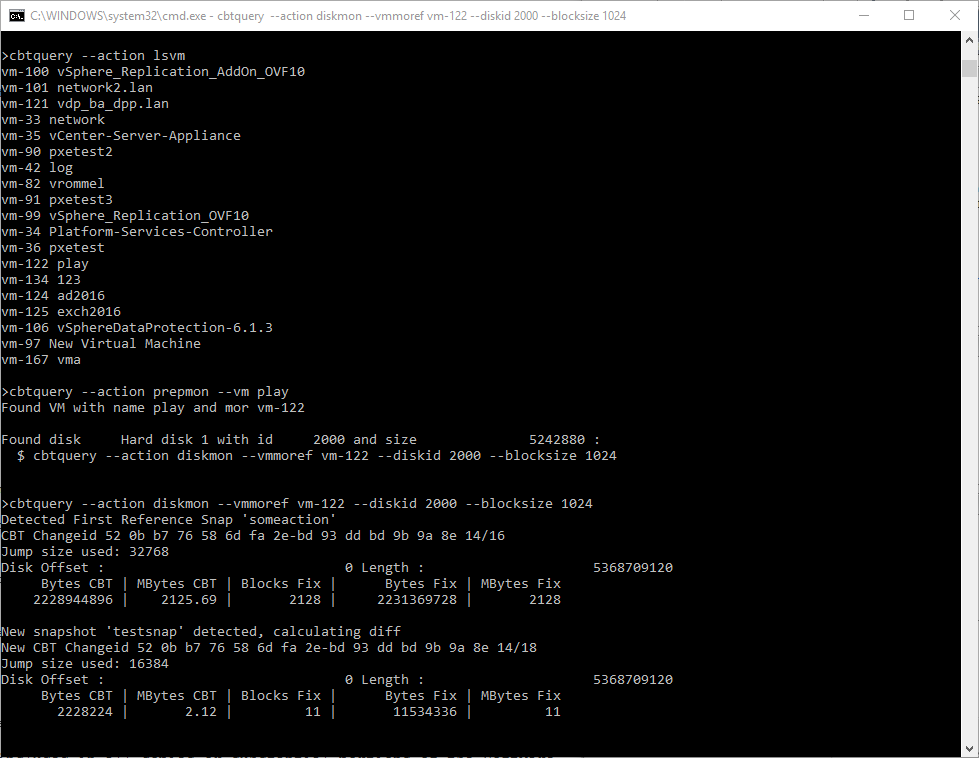

# CBT Query

Simple example usage:

Start by setting username and password as variable (you can add them to cmd as well but it will just make it longer)

The connection settings follow the vsphere SDK app util. Connection might be complex, this is why cbtquery also looks for EASYSERVER which:
* set the url to https://fqdn/sdk
* ignorecertificates
* disablesso


```
set VI_EASYSERVER=vcenter.fqdn
set VI_USERNAME=administrator@vsphere.local
set VI_PASSWORD=mysecretpass
```

Get VMs
```
cbtquery --action lsvm
```

Get the disk for a specific vm
```
cbtquery --action prepmon --vm myvm
```

Monitor the disk (the vmmoref and disk id will be shown by prepmon)
```
cbtquery  --action diskmon --vmmoref vm-111 --diskid 2000 --blocksize 1024
```



Now make a initial snapshot via the vsphere client. All used blocks will be calculated. Make an additional snap to  see the change rate

## VeeamHub
Veeamhub projects are community driven projects, and are not created by Veeam R&D nor validated by Veeam Q&A. They are maintained by community members which might be or not be Veeam employees. 

## Distributed under MIT license
Copyright (c) 2016 VeeamHub

Permission is hereby granted, free of charge, to any person obtaining a copy of this software and associated documentation files (the "Software"), to deal in the Software without restriction, including without limitation the rights to use, copy, modify, merge, publish, distribute, sublicense, and/or sell copies of the Software, and to permit persons to whom the Software is furnished to do so, subject to the following conditions:

The above copyright notice and this permission notice shall be included in all copies or substantial portions of the Software.

THE SOFTWARE IS PROVIDED "AS IS", WITHOUT WARRANTY OF ANY KIND, EXPRESS OR IMPLIED, INCLUDING BUT NOT LIMITED TO THE WARRANTIES OF MERCHANTABILITY, FITNESS FOR A PARTICULAR PURPOSE AND NONINFRINGEMENT. IN NO EVENT SHALL THE AUTHORS OR COPYRIGHT HOLDERS BE LIABLE FOR ANY CLAIM, DAMAGES OR OTHER LIABILITY, WHETHER IN AN ACTION OF CONTRACT, TORT OR OTHERWISE, ARISING FROM, OUT OF OR IN CONNECTION WITH THE SOFTWARE OR THE USE OR OTHER DEALINGS IN THE SOFTWARE.

## Project Notes
Powershell sample scripts that can be reused / adapted. Please do not just execute scripts without understanding what each and every line will do.